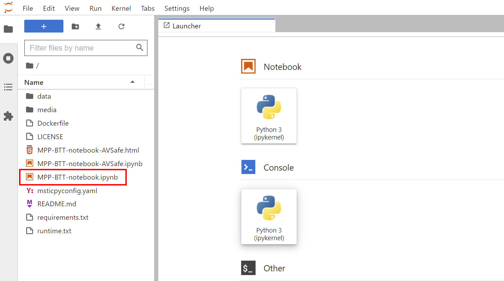

# Running the notebook in Docker

The following commands are identical on Windows, Linux or MacOS.

## 1. Get or build the docker image

You can pull a version from DockerHub or there is a Dockerfile in this repo
if you prefer to build your own image.

```
$ docker pull ianhelle/pluralsightbttmsticpy:latest

latest: Pulling from ianhelle/pluralsightbttmsticpy
Digest: sha256:ee181fb915bfd822c5d1623b7fd01cd73d82837f8197ef1b8c8f01d818a9df70
Status: Image is up to date for ianhelle/pluralsightbttmsticpy:latest
docker.io/ianhelle/pluralsightbttmsticpy:latest
```

## 2. Run the docker image

```
$ docker run --rm -p 8888:8888/tcp pluralsightbttmsticpy:latest

Entered start.sh with args: jupyter lab
Executing the command: jupyter lab
[I 2022-03-29 23:36:52.736 ServerApp] jupyterlab | extension was successfully linked.
....
```

If you want to use a different port to the default JupyterHub 8888 on your local machine
replace the `-p 8888:8888` with `-p PORT_NUM:8888` (where PORT_NUM is the number of the
port that you want to use to connect to the docker container).
These numbers represent a port mapping from external (the port that Docker exposes externally) to internal (the port used by JupyterHub running in the container).

The run command should show JupyterLab starting and print out the connection URL
```
...
 http://127.0.0.1:8888/lab?token=47c8b8591598244c11a925751f4c4c950af73c27a5820bcb
[I 2022-03-29 23:36:52.976 ServerApp] Use Control-C to stop this server and shut down all kernels (twice to skip confirmation).
[C 2022-03-29 23:36:52.979 ServerApp]

    To access the server, open this file in a browser:
        file:///home/jovyan/.local/share/jupyter/runtime/jpserver-7-open.html
    Or copy and paste one of these URLs:
        http://1f2f9c566191:8888/lab?token=47c8b8591598244c11a925751f4c4c950af73c27a5820bcb
     or http://127.0.0.1:8888/lab?token=47c8b8591598244c11a925751f4c4c950af73c27a5820bcb
```

Click on the last of the these URLs or Copy/Paste into your browser.
The `http://127.0.0.1:8888` URL is usually the simplest. If you started
the Docker container using a port other that 8888 (see previous section),
you will need to replace the 8888 in your browser URL with the number of
the port you are using.

## 3. Start the notebook

You browser should navigate the to the JupyterLab home screen.
Double-click on the notebook (outlined in red) to start the notebook.
